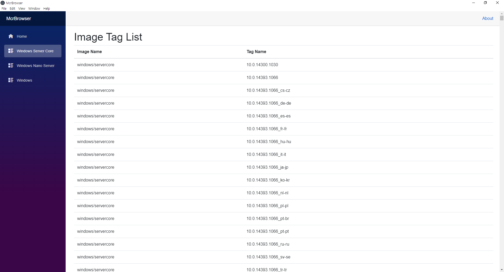

# McrBrowser

This application helps users to find custom image tag from public MCR repository.

## How to build

1. Install Node.JS and NPM
1. Install ElectronNET.CLI dotnet tool as global
1. Run `electronize start` command

## License

MIT License
